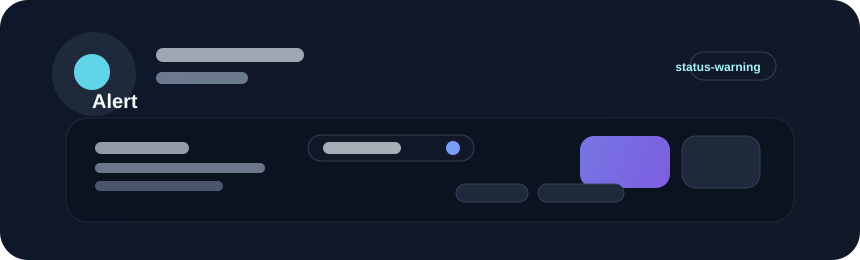

# Alert



Alerts communicate notable information, warnings, or errors without blocking the entire screen. They are best for status messages that need to be noticed quickly but do not require the user to stop other work.

## When to use

Use an alert for:

- validation or error messages that deserve attention
- warning states such as low storage, degraded connectivity, or pending actions
- success messages that are useful but not urgent enough for a modal
- context-sensitive notices tied to a specific section or workflow

## Example

```rust
use bevy::prelude::*;
use beverly::prelude::*;

fn build_alert(mut commands: Commands) {
    commands.spawn(BeverlyAlert::new("Storage nearly full")
        .variant(AlertVariant::Warning)
        .action("Review"));
}
```

## Guidance

Keep alerts concise and scannable. A good alert makes the state clear, explains the consequence briefly, and offers an action when the user can act right away.

## Accessibility

Alerts should remain readable without relying on color alone. Pair semantic text with iconography or clear labels so a user can understand critical state quickly in both standard and high-contrast themes.
