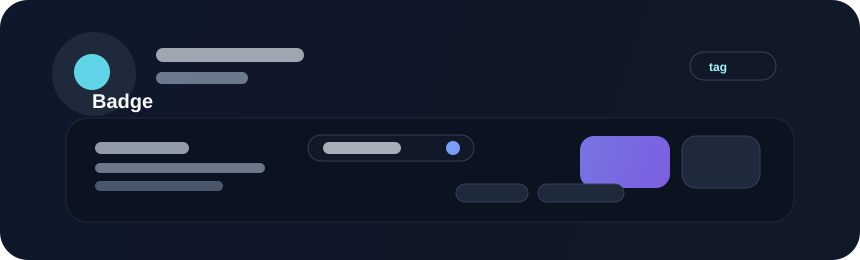

# Badge



Badges are compact status markers. They work well for states, counts, tags, or short labels that need to be visible at a glance without absorbing much visual weight.

## When to use

Use a badge for:

- online or offline status
- subscription or tier labels
- system-health or deployment status
- counts in lists, tables, and nav surfaces
- short tags that add metadata to a broader item

## Example

```rust
use bevy::prelude::*;
use beverly::prelude::*;

fn build_status(mut commands: Commands) {
    commands.spawn(BeverlyBadge::new("Live")
        .variant(BadgeVariant::Success));
}
```

## Guidance

Keep badge text short. If the label needs more than a few words, it should likely be a richer surface such as an alert, list item metadata, or an inline status widget.

## Accessibility

Use badges as supplemental information rather than as the sole source of meaning. A badge should not be the only way the app communicates critical state; text and semantics should reinforce it.
