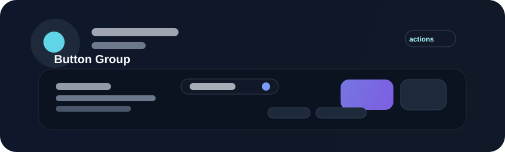

# Button Group



Button groups cluster related actions that belong together while maintaining a shared visual rhythm. They are useful when users need to choose between a small set of alternatives or perform closely related actions within a single context.

## When to use

Use a button group for:

- grouped actions on a summary card or toolbar
- mode switching such as list view versus grid view
- a small set of related choices that should feel visually connected
- tools that belong to the same workflow or surface

## Example

```rust
use bevy::prelude::*;
use beverly::prelude::*;

fn build_actions(mut commands: Commands) {
    commands.spawn(BeverlyButtonGroup::new()
        .button("Preview")
        .button("Save")
        .button("Publish"));
}
```

## Guidance

Group actions that share a purpose and sequence. Do not combine highly different priorities in the same cluster without a clear hierarchy. Use spacing, emphasis, and ordering to signal which action is primary.

## Accessibility

A button group should preserve a logical focus order and clear state treatment. If one button is recommended as the primary choice, ensure that the visual and keyboard flow support that hierarchy as well.
