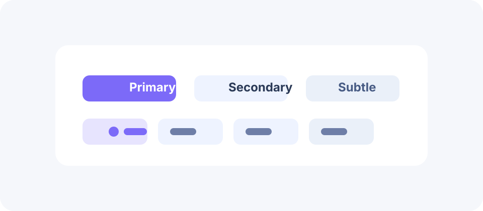
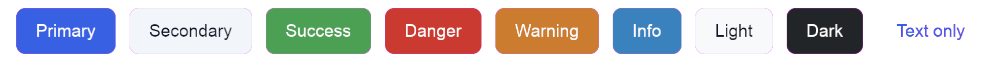
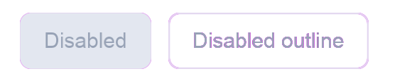
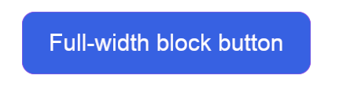

# Button

Buttons are the most common action primitive in Beverly. They should feel obvious, readable, and safe to activate. A button is not just a visual element; it is the clearest expression of a command in the interface, and it carries responsibility for clarity, hierarchy, and trust.



## Overview

Use buttons for actions that change state, submit data, navigate to the next step, or trigger a workflow. They should be easy to scan, consistent across the app, and clearly distinct from content that only looks interactive.

This means a button should make its intent obvious even without examining the surrounding page. The label, role, and emphasis all contribute to that clarity.

## When to use

Use a button for a direct action such as submitting, navigating, confirming, or launching a workflow. Buttons should be used for commands, not for passive display or purely decorative emphasis.

If the control is not an action, a different primitive is usually more appropriate. The product feels better when button usage stays meaningfully narrow and intentional.

## Button colors

Every `BeverlyButton` is built around one of nine semantic colors:

- `primary` for the main action in a surface
- `secondary` for supporting actions that are still important
- `success`, `danger`, `warning`, and `info` for outcome- or status-driven actions
- `light` and `dark` for buttons that need to sit on the opposite tone of surface (a dark button on a light toolbar, a light button on a dark navbar)
- `text` for a text-only appearance with no fill or border, similar to a hyperlink

```rust
use bevy::prelude::*;
use beverly::prelude::*;

fn spawn_color_options(mut commands: Commands) {
    commands.spawn(BeverlyButton::primary("Primary"));
    commands.spawn(BeverlyButton::secondary("Secondary"));
    commands.spawn(BeverlyButton::success("Success"));
    commands.spawn(BeverlyButton::danger("Danger"));
    commands.spawn(BeverlyButton::warning("Warning"));
    commands.spawn(BeverlyButton::info("Info"));
    commands.spawn(BeverlyButton::light("Light"));
    commands.spawn(BeverlyButton::dark("Dark"));
    commands.spawn(BeverlyButton::text("Text only"));
}
```



Keep the hierarchy clear. Most surfaces should have one obvious primary action and a smaller number of supporting controls, with `success`/`danger`/`warning`/`info` reserved for actions whose color communicates a real outcome (confirm, delete, an irreversible change, a status-driven shortcut) rather than decoration.

This prevents the page from collapsing into a visual pile of equally important buttons, which often makes the actual user task harder to infer.

## Basic example

```rust
use bevy::prelude::*;
use beverly::prelude::*;

fn spawn_primary_action(mut commands: Commands) {
    commands.spawn(BeverlyButton::primary("Deploy"));
}
```

`ButtonPlugin` (added automatically by `BeverlyPlugin`) reacts to newly-spawned `BeverlyButton`s: it builds the label/icon children, computes fill/border/text colors for the current theme and color, and wires up pointer, keyboard, and screen-reader support. No extra `Node`, `Surface`, or `AccessibilityNode` setup is required.

## Outline style

Every color also has an outline appearance: a transparent fill with a colored border and label, filling in with a soft tint of that color on hover and press.

```rust
use bevy::prelude::*;
use beverly::prelude::*;

fn spawn_outline_actions(mut commands: Commands) {
    commands.spawn(BeverlyButton::primary("Preview").outline(true));
    commands.spawn(BeverlyButton::danger("Discard").outline(true));
}
```


Use outline buttons for secondary or lower-emphasis actions that should still carry a clear semantic color, without competing visually with a solid primary action next to them.

`secondary` and `light` are themed as near-white neutrals, so their outline border/label color has very low contrast on a light page background (as visible above) — prefer their solid form, or a darker color, in light-background layouts.

## Disabled state

Setting `disabled` does more than dim the button: it removes it from the tab order, blocks pointer and keyboard activation, and announces the disabled state to assistive technology.

```rust
use bevy::prelude::*;
use beverly::prelude::*;

fn spawn_unavailable_action(mut commands: Commands) {
    commands.spawn(BeverlyButton::primary("Save").disabled(true));
}
```



Disabled buttons render with the theme's neutral border/muted-text colors regardless of their configured color, so unavailability is visible even without color perception. Toggle `disabled` at runtime (`button.disabled = false`) to re-enable a control once its action becomes available again; screen readers and keyboard focus order update automatically.

## Block (full width)

Set `block` to stretch a button to the full width of its parent, useful when it is the single dominant action in a narrow container such as a mobile layout or a confirmation panel.

```rust
use bevy::prelude::*;
use beverly::prelude::*;

fn spawn_full_width_action(mut commands: Commands) {
    commands.spawn(BeverlyButton::primary("Continue").block(true));
}
```



Prefer the default content-sized width for most content areas, and reserve `block` for layouts where the button really is the dominant action, so the interface stays easy to scan.

## Button variants

Different button styles should map to different levels of emphasis.

```rust
use bevy::prelude::*;
use beverly::prelude::*;

fn spawn_action_row(mut commands: Commands) {
    commands.spawn((
        NodeBundle::default(),
        BeverlyButtonGroup::new()
            .button("Preview")
            .button("Discard")
            .button("Publish")
    ));
}
```

In practice, a primary button should be reserved for the action the user is most likely to choose, while secondary and subtle buttons should support that choice without competing with it. Accent buttons are best used sparingly when the interface needs a stronger visual cue than the default hierarchy provides.

## Buttons with an icon

Add a leading icon to any color/style combination with `.icon(...)`, using a bundled Feather icon name. The icon inherits the same computed foreground color as the label, so it stays legible in every state.

```rust
use bevy::prelude::*;
use beverly::prelude::*;

fn spawn_icon_button(mut commands: Commands) {
    commands.spawn(BeverlyButton::primary("Save").icon("save"));
}
```

Use the label when the action name matters, and lean on the icon alone (a short, unambiguous label like "Search") only when space is constrained and the meaning is already obvious from the surrounding context.

## Sizing and width

Buttons should feel proportionate to the surrounding layout. Use a compact size for dense toolbars, a normal size for most content areas, and a larger presentation only when the action needs extra prominence.

Prefer full-width buttons only when the button is the dominant action in a narrow container, such as a mobile layout, a confirmation panel, or a short setup flow. Otherwise, let the button width follow its content so the layout stays easier to scan.

## States

A button should provide clear feedback for:

- default
- hover
- pressed
- focus-visible
- disabled
- loading

This helps users understand whether the action is ready, busy, or unavailable without guessing from layout or color alone.

This is especially important in systems with asynchronous operations, because a loading or disabled state should clearly communicate that the button cannot yet be activated again.

## Toggle behavior

Some button patterns behave like toggles or grouped choices rather than one-off actions. Use those patterns when the control needs to represent a persistent state or an exclusive selection.

```rust
use bevy::prelude::*;
use beverly::prelude::*;

fn build_toggle_row(mut commands: Commands) {
    commands.spawn(BeverlyButtonGroup::new()
        .button("List")
        .button("Grid")
        .button("Compact"));
}
```

Keep toggle-like buttons visually connected so the relationship is obvious, and make the current choice easy to identify from both sighted and keyboard navigation.

## Accessibility

`BeverlyButton` wires every button into Beverly's shared accessibility primitives automatically, rather than leaving it to each call site:

- **Accessible label.** The button's `label` becomes an AccessKit `Role::Button` node with a matching name, so screen readers (VoiceOver, NVDA, JAWS, Orca) announce the button's purpose, not just "button".
- **Keyboard focus and activation.** Every button gets `TabIndex(0)` so it participates in Tab/Shift+Tab navigation, and the shared interaction pipeline maps Enter/Space (and the same tap gesture pointer uses) to the same activation action — there is no separate, pointer-only code path.
- **Real disabled semantics, not just a dimmer look.** `disabled(true)` inserts `DisabledInteraction`, which the shared interaction system uses to force `Interaction::None` and skip activation entirely — a disabled button cannot be "accidentally" triggered by a stray click or Enter key. It also sets `TabIndex(-1)` (removed from tab order) and marks the AccessKit node disabled, so assistive technology reports it as unavailable rather than silently ignoring input.
- **Not color alone.** Disabled buttons always render with the theme's neutral border and muted-text colors, replacing their configured color entirely — the state is visible even to users who cannot perceive color differences, on top of the non-interactive/AT-disabled semantics above.
- **Guaranteed contrast.** Foreground (label/icon) color is chosen from the *actual rendered fill*, not just the active theme mode, so a `light` button always gets dark text and a `dark` button always gets light text, even when that's the opposite of the current theme's own text color.
- **Reduced-motion safe.** Hover/press feedback is a static color shift (no animated easing), so there is nothing to disable for `prefers-reduced-motion` users.

Buttons are one of the most common keyboard interaction points, so their accessibility is a high-value issue. A button that looks fine but cannot be reached, activated, or understood through keyboard navigation and screen readers still fails its primary purpose.

## Implementation notes

Choose the least surprising control for the task. If the user needs a single definitive action, use one primary button. If they need to choose among a few nearby actions, use a button group. If the action is mostly navigational, consider whether a link or a different surface would communicate intent more clearly.

The button should make the product feel decisive instead of uncertain. That means the primary action should come first, secondary actions should remain visually subordinate, and low-priority controls should not distract from the task.

## Styling guidance

Use primary buttons for the main action, secondary buttons for supporting actions, and outline or text buttons for low-priority choices. Keep spacing and touch targets consistent across screens so the interface feels predictable and easy to scan. When a page has many actions, reduce the number of high-emphasis buttons so the interface keeps a clear visual hierarchy.

## Summary

Beverly buttons should be clear, calm, and strongly aligned with the user’s task. They are one of the interface’s most important communication tools, so their hierarchy and behavior should be treated with the same care as the layout itself.
