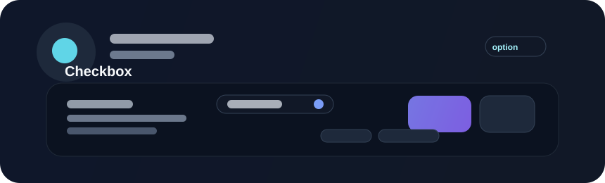

# Checkbox



Checkboxes represent independent on/off choices within a form or settings surface. They are best for options where multiple selections can be valid at the same time.

## Example

```rust
use bevy::prelude::*;
use beverly::prelude::*;

fn build_preferences(mut commands: Commands) {
    commands.spawn(BeverlyCheckbox::new("Enable notifications")
        .checked(true));
}
```

## Behavior

- independent selection state
- can be grouped with other checkboxes
- should expose a visible label and optional description
- should participate in keyboard navigation and form submission state

## When not to use

Use a radio group when the user must choose exactly one option from a set. Use a checkbox when multiple independent selections are valid.

## Accessibility

The label should be visually adjacent and semantically associated with the checkbox. The control must be operable with keyboard input, and the selected state should be communicated clearly without relying only on color.
