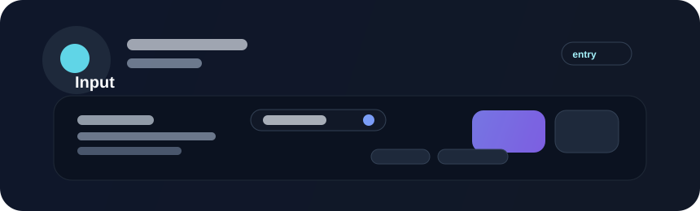

# Input



Inputs capture user-provided text or scalar values. Beverly inputs should feel native to the app and expose strong semantics for labels, validation, and keyboard navigation.

## Example

```rust
use bevy::prelude::*;
use beverly::prelude::*;

fn build_form(mut commands: Commands) {
    commands.spawn((
        NodeBundle::default(),
        BeverlyInput::new("Project name")
            .placeholder("my-feature")
            .required(true)
    ));
}
```

## Validation states

Common states include:

- empty
- filled
- focused
- invalid
- disabled

Use a visible validation hint and keep field errors close to the relevant control. A field without clear guidance can create friction even if the control itself is technically editable.

## Accessibility

Associate each input with a visible label, keep focus order logical, and ensure the control remains operable with a keyboard and screen reader. Error state should also be clear and actionable, not only indicated through an unlabeled color change.
