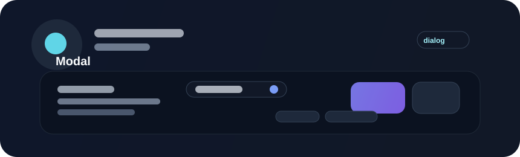

# Modal



Modals interrupt the current flow to request a decision or present a focused task. They are powerful for critical confirmations and short interactions that must temporarily take over the user's attention.

## Example

```rust
use bevy::prelude::*;
use beverly::prelude::*;

fn open_delete_modal(mut commands: Commands) {
    commands.spawn(BeverlyModal::new("Delete item")
        .body("This action cannot be undone.")
        .confirm_label("Delete")
        .cancel_label("Cancel"));
}
```

## Usage guidance

Use modals sparingly. They are best for critical decisions or short focused operations. Keep the content narrow and the action labels explicit, and avoid including long-form content or complex flows inside an interruptive layer.

## Accessibility

Trap focus while the modal is open, restore focus when it closes, and maintain clear labels for close and action controls. A modal that loses focus or returns the user to the wrong element is frustrating and often impossible to operate from the keyboard alone.
