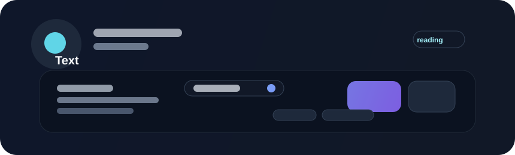

# Text



Text is the default body-content primitive in Beverly. It is used for descriptions, helper copy, metadata, and any other supporting content that should read as part of the surrounding interface rather than as a major heading.

## When to use

Use text when the content should read as part of the surrounding surface instead of as a headline or control. It is the layer that carries explanation, metadata, and narrative help.

## Implementation pattern

Block Studio-style composition keeps text as a lightweight semantic block that inherits the app's typography rules. That keeps copy consistent across cards, panels, headers, and other surfaces without creating a separate text system for each screen.

`ThemedText` never owns the string itself - it decorates a regular `bevy::prelude::Text` entity with a `TextRole` and optional per-instance size/color overrides. The theme drives size and color unless you opt out of that with an explicit override.

## Example

```rust
use bevy::prelude::*;
use beverly::prelude::*;

fn build_copy(mut commands: Commands) {
    commands.spawn((Text::new("Last synced 2 minutes ago"), ThemedText::new(TextRole::Body)));
}
```

## Roles

`TextRole` picks both the default size and color from the active theme, so a role change alone is usually enough to restyle a piece of copy:

- `Heading` - theme's title size, default text color
- `Body` - theme's body size, default text color
- `Label` - body size minus 2px, default text color
- `Caption` - theme's caption size, muted text color
- `Muted` - body size, muted text color
- `Accent` - body size minus 2px, primary/brand color
- `Disabled` - body size, disabled text color

```rust
use bevy::prelude::*;
use beverly::prelude::*;

fn build_metadata(mut commands: Commands) {
    commands.spawn((Text::new("Last synced 2 minutes ago"), ThemedText::new(TextRole::Caption)));
}
```

## Changing size

Reach for a different `TextRole` first. When a screen genuinely needs a size the roles don't provide, call `.size(px)` on `ThemedText` for a one-off override on that instance:

```rust
use bevy::prelude::*;
use beverly::prelude::*;

fn build_copy(mut commands: Commands) {
    // Uses the theme's body size.
    commands.spawn((Text::new("Everything is running normally."), ThemedText::new(TextRole::Body)));

    // One-off pixel override for a single instance; still themed for color.
    commands.spawn((Text::new("New"), ThemedText::new(TextRole::Label).size(11.0)));
}
```

### Changing sizes globally

Because every role without an explicit `.size()` override is derived from the theme, resizing all body copy at once is a theme change, not a per-text change. Update `ThemeTypography::font_size_body` (or `font_size_caption`/`font_size_title`) on the active theme and every matching `ThemedText` rescales automatically:

```rust
use bevy::prelude::*;
use beverly::prelude::*;

fn shrink_body_text(mut theme: ResMut<ThemeResource>) {
    theme.current.typography.font_size_body = 14.0;
}
```

## Changing color

Prefer a `TextRole` change over a manual color, since roles keep copy consistent across light, dark, and branded themes. When an instance genuinely needs a different color, call `.color(...)` on `ThemedText`:

```rust
use bevy::prelude::*;
use beverly::prelude::*;

fn build_status(mut commands: Commands) {
    // Themed automatically: muted foreground from the active theme.
    commands.spawn((Text::new("Last updated 2 minutes ago"), ThemedText::new(TextRole::Caption)));

    // One-off override for a single instance.
    commands.spawn((
        Text::new("Sync failed"),
        ThemedText::new(TextRole::Body).color(Color::srgb(0.86, 0.2, 0.2)),
    ));
}
```

Changing the theme's colors (for example `ThemeColors::text_muted` or `ThemeColors::primary`) restyles every `ThemedText` of the matching role at once, the same way resizing `ThemeTypography` does.

## Changing the font

`ThemedText` itself has no font-family knob - font family is controlled by the `Typography` component, which is always present on a `Text` entity. Reach for `Typography` when the family needs to change; `ThemedText` keeps driving the theme-scaled size and color as long as `Typography` is left at its defaults.

### For one piece of text

Call `.with_family(...)` on `Typography`. This opts that entity out of `ThemedText`'s automatic sizing, so pair it with `.with_size(...)` if you still want a scaled value:

```rust
use bevy::prelude::*;
use beverly::prelude::*;
use beverly::components::text::Typography;

fn build_copy(mut commands: Commands) {
    commands.spawn((
        Text::new("Last synced 2 minutes ago"),
        ThemedText::new(TextRole::Caption),
        Typography::default().with_family("Inter").with_size(12.0),
    ));
}
```

### Setting the global font

Register the replacement face under Beverly's default family name, `"DefaultSans"`, so every text and title node that doesn't set an explicit `Typography` family picks it up. Do this in `Update` (guarded to run once) rather than `Startup`, since Beverly's own font bootstrap also runs in `Startup` and schedule ordering between two `Startup` systems from different plugins isn't guaranteed - `Update` always runs after `Startup` has fully completed:

```rust
use std::sync::Arc;

use bevy::prelude::*;
use beverly::prelude::*;
use beverly::components::text::{FontStyle, FontWeight, TypographyFontManager};

fn register_brand_font(
    mut manager: ResMut<TypographyFontManager>,
    asset_server: Res<AssetServer>,
    mut done: Local<bool>,
) {
    if *done {
        return;
    }
    *done = true;

    let asset_path = "fonts/Inter-Regular.ttf";
    manager.register_face(
        "DefaultSans",
        FontWeight::NORMAL,
        FontStyle::Normal,
        asset_path,
        asset_server.load(asset_path),
        Arc::new(include_bytes!("../assets/fonts/Inter-Regular.ttf").to_vec()),
    );
}
```

Every existing `Text` entity that hasn't opted into a custom `Typography` family - across text, titles, buttons, and any other component built on the same text pipeline - picks up the new face the next time it lays out, with no per-component changes required.

## Guidance

- use text for supporting copy and short explanations
- keep it legible in dense layouts
- let the surrounding layout control spacing and alignment
- prefer concise, direct wording over ornamental writing
- reach for a `TextRole` before a manual size or color override

## Accessibility

Text should maintain strong legibility and proper contrast across themes. Supporting text should not become visually subtle in a way that hurts readability or comprehension. Manual `.color()` overrides bypass the theme's contrast guarantees, so verify contrast yourself whenever you use one instead of a `TextRole`.
