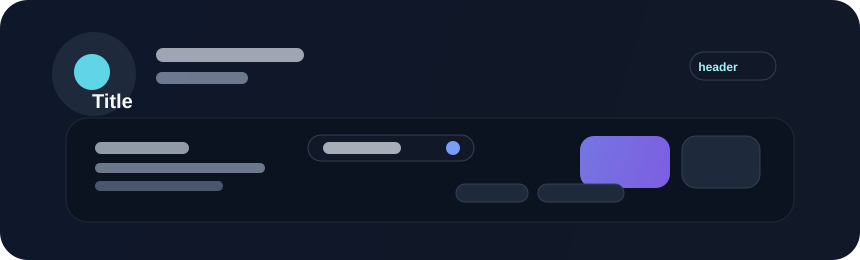

# Title



Titles are the primary hierarchy marker in Beverly. They help users scan a screen quickly and understand which surface they are looking at.

## When to use

Use title text for page headers, panel headings, card labels, and other high-emphasis content that should stand out from supporting copy. Titles should establish the immediate context before the user reads the details below.

## Implementation pattern

Block Studio treats title as a reusable semantic block rather than a one-off label. Beverly follows the same approach: the title component should inherit the shared font, theme, and spacing system instead of carrying custom styling per screen.

`ThemedTitle` never owns the text itself - it decorates a regular `bevy::prelude::Text` entity with a `TitleLevel` and optional per-instance overrides. The theme drives size and color unless you opt out of that with an explicit override.

## Example

```rust
use bevy::prelude::*;
use beverly::prelude::*;

fn build_header(mut commands: Commands) {
    commands.spawn((Text::new("Workspace"), ThemedTitle::new(TitleLevel::H1)));
}
```

## Sizes

`TitleLevel` gives you a fixed type scale (`Display`, `H1`-`H6`). Each level is a multiplier applied to the active theme's `font_size_title`, so the whole scale grows or shrinks together instead of drifting out of sync.

```rust
use bevy::prelude::*;
use beverly::prelude::*;

fn build_header(mut commands: Commands) {
    // Uses the theme's H1 scale value.
    commands.spawn((Text::new("Workspace"), ThemedTitle::new(TitleLevel::H1)));

    // One-off pixel override for a single instance; still themed for color.
    commands.spawn((Text::new("Beta"), ThemedTitle::new(TitleLevel::H3).size(28.0)));
}
```

Reach for a different `TitleLevel` first, and only fall back to `.size(px)` when a screen genuinely needs a size the scale doesn't provide.

### Changing sizes globally

Because every level is derived from the theme, resizing the whole scale is a theme change, not a per-title change. Update `ThemeTypography::font_size_title` on the active theme and every `ThemedTitle` without an explicit `.size()` override rescales automatically:

```rust
use bevy::prelude::*;
use beverly::prelude::*;

fn shrink_titles(mut theme: ResMut<ThemeResource>) {
    theme.current.typography.font_size_title = 20.0;
}
```

## Changing the font

`ThemedTitle` itself has no font-family knob - font family is controlled by the `Typography` component, which is always present on a `Text` entity. Reach for `Typography` when the family needs to change; `ThemedTitle` keeps driving the theme-scaled size and color as long as `Typography` is left at its defaults.

### For one title

Call `.with_family(...)` on `Typography`. This opts that entity out of `ThemedTitle`'s automatic sizing, so pair it with `.with_size(...)` if you still want a scaled value:

```rust
use bevy::prelude::*;
use beverly::prelude::*;
use beverly::components::text::Typography;

fn build_header(mut commands: Commands) {
    commands.spawn((
        Text::new("Workspace"),
        ThemedTitle::new(TitleLevel::H1),
        Typography::default().with_family("Inter").with_size(34.0),
    ));
}
```

### Globally

Register the replacement face under Beverly's default family name, `"DefaultSans"`, so every title and text node that doesn't set an explicit `Typography` family picks it up. Do this in `Update` (guarded to run once) rather than `Startup`, since Beverly's own font bootstrap also runs in `Startup` and schedule ordering between two `Startup` systems from different plugins isn't guaranteed - `Update` always runs after `Startup` has fully completed:

```rust
use std::sync::Arc;

use bevy::prelude::*;
use beverly::prelude::*;
use beverly::components::text::{FontStyle, FontWeight, TypographyFontManager};

fn register_brand_font(
    mut manager: ResMut<TypographyFontManager>,
    asset_server: Res<AssetServer>,
    mut done: Local<bool>,
) {
    if *done {
        return;
    }
    *done = true;

    let asset_path = "fonts/Inter-Regular.ttf";
    manager.register_face(
        "DefaultSans",
        FontWeight::NORMAL,
        FontStyle::Normal,
        asset_path,
        asset_server.load(asset_path),
        Arc::new(include_bytes!("../assets/fonts/Inter-Regular.ttf").to_vec()),
    );
}
```

## Internationalization

Keep the label text out of the component entirely - pass in whatever string a translation lookup returns instead of a hard-coded literal, so the same screen renders correctly for every locale:

```rust
use bevy::prelude::*;
use beverly::prelude::*;

#[derive(Resource)]
struct Localization {
    strings: std::collections::HashMap<&'static str, &'static str>,
}

impl Localization {
    fn text(&self, key: &str) -> &str {
        self.strings.get(key).copied().unwrap_or(key)
    }
}

fn build_header(mut commands: Commands, localization: Res<Localization>) {
    let heading = localization.text("workspace.title");
    commands.spawn((Text::new(heading), ThemedTitle::new(TitleLevel::H1)));
}
```

For right-to-left locales, attach `Typography` with `.with_language(...)` so shaping and layout follow the locale's script; leave `direction` on its default `TextDirection::Auto` unless a locale needs to force a specific direction:

```rust
use beverly::components::text::Typography;

fn arabic_title(mut commands: Commands, localization: Res<Localization>) {
    commands.spawn((
        Text::new(localization.text("workspace.title")),
        ThemedTitle::new(TitleLevel::H1),
        Typography::default().with_language("ar"),
    ));
}
```

## Guidance

- keep titles short and direct
- place them near the top of the relevant surface
- use them to anchor the page or section hierarchy
- avoid stacking multiple large titles in a row without a clear relationship between them

## Accessibility

Titles should be semantic and meaningful. They help screen-reader users orient themselves in the interface and should fit the surrounding content without creating a noisy or overloaded reading order.
