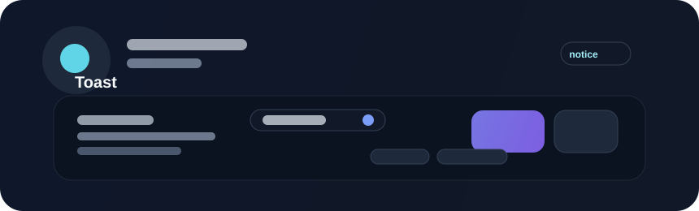

# Toast



Toasts display brief status changes such as successful saves, queued jobs, or transient warnings. They are useful for lightweight feedback that should not interrupt the user's flow but should still be noticeable.

## Example

```rust
use bevy::prelude::*;
use beverly::prelude::*;

fn show_success_toast(mut commands: Commands) {
    commands.spawn(BeverlyToast::success("Saved successfully"));
}
```

## Best practices

- keep messages short and informational
- avoid stacking too many toasts at once
- support dismissal and a clear lifetime
- prefer live status updates in the UI when the state must remain visible
- ensure that the user can still continue their main task without losing context

## Accessibility

Toast content should remain readable and should not disappear so quickly that keyboard or screen-reader users cannot interpret it. When state is critical, it is often better to use a persistent inline status or a modal instead of a transient toast alone.
